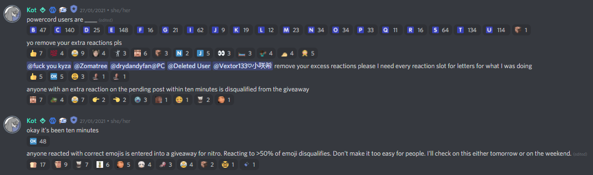
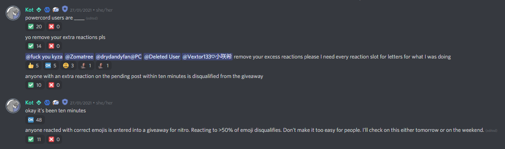

# no-reaction-spam
A powercord plugin that hides reactions on messages where the number of unique reactions exceeds a specified threshold.
It provides an easy way to remove 10s of unique reactions you don't care about, whilst still being able to react to giveaways and polls.

Turns this mess

Into this

When clicked, the tick will show all reactions, and the cross will remove itself and the tick. These are optional and can be disabled in the settings tab for ultimate spam removal.

Additionally, the reaction count for the tick emoji shows the number of reactions hidden. 